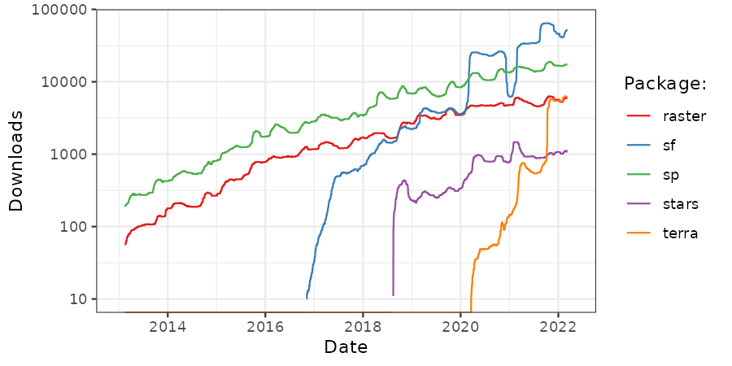
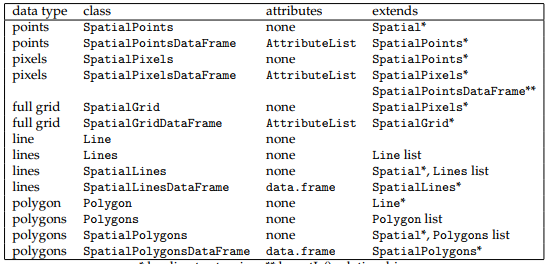
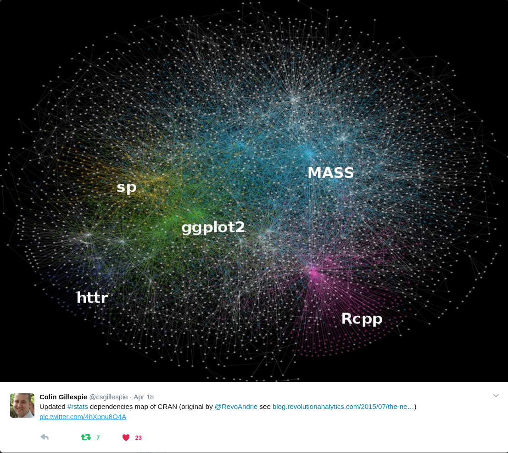
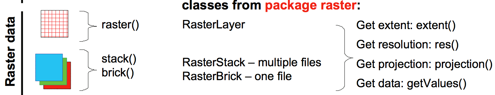
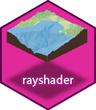

## 1 Motivación {.smaller}

::: incremental
¿Por qué utilizar `R` para procesar datos geoespaciales?

- `R` en su nucleo, es un lenguaje de programación `orientada a objetos` de alto nivel, lenguaje de programación funcional (Wickham, 2014), y fue especialmente diseñado como una interfaz intercativa a otros softwares (Chambers 2016).

- `R` es una herramienta potente que ha tenido un alto crecimiento, en particular para el análisis espacial.

- Revolución de geodata (ej., datos satelitales). 

- `R` para entender el mundo 

- `R` es un ambiente y lenguaje de código abierto y multiplataforma para computacion estadística y gráficos.

- Por todas las ventajas que tiene para análisis de datos (includios espaciales) e investigación reproducible.
:::

# Un poco de historia {background-color="orange"}

## 2. Ranking popularidad `R`

```{r}
#| echo: false
knitr::include_url({"https://pypl.github.io/PYPL.html?country=DE"})
```

## 2. Evolución de paquetes espaciales

{width="100%" fig-align="center"}

## 3. Antecedentes {.smaller}

::: incremental
- Desde los inicios de `R` se han desarrollado paquetes para análisis de datos geoespaciales.
- Point pattern analysis
- geostadística
- análisis exploratorio de datos geoespaciales
- Sin embargo se trabajaba sobre los tipos de datos que existian en `R` (matrix, data.frame, list, arrays).
- Dos hítos importantes:
    - `{rgdal}` publicado en 2003 `(Bivand, Keitt, and Rowlingson, 2020b)`
    - `{sp}` publicado en 2005 `(Pebesma and Bivand, 2005; Bivand, Pebesma, and Gomez-Rubio, 2013)`
:::


## 4. Paquetes de R-Spatial

### `{rgdal}`
- Permite utilizar la libreria [`GDAL (OSGEO)`](https://gdal.org/) en `R` (binding) 
- `{rgdal}` permite manejar datos raster y vectorial


## 3. Paquetes de R-Spatial

### `{sp}` 

- trae tipos de datos espaciales a `R`

{fig-align="center" width=800}

## 3. Paquetes de R-Spatial

### `{sp}`

{width="60%" fig-align="center"}


## 3. Paquetes de R-Spatial

### `{rgeos}`

- Permite utilizar operaciones espaciales de la libreria [GEOS](https://trac.osgeo.org/geos) con objetos `{sp}`
  - Union, distancia, intersección, etc
  - publicada el 2011

## 3. Paquetes de R-Spatial

- {width=50} publicado 2016 da soporte para [`Simple Feature`](https://en.wikipedia.org/wiki/Simple_Features)

{width="70%" fig-align="center"}


---
## 3. Paquetes de R-Spatial

### {raster}

- `{sp}` tiene limitado soporte para obtejos raster
- `{raster}` publicado el 2010
    - Permite trabajar con datos raster que son demasiado grandes para caber en la RAM.
    - Proporciona algebra raster



## 3. Paquetes de R-Spatial {.smaller}

### ¿Qué está pasando ahora en el mundo `r-spatial`?

- `{terra}` publicado 2020, mejoras sobre `{raster}` 
- `{stars}` Raster and Vector Datacubes  
- `{rgee}` Google Earth Engine desde `R`  
- `{rayshader}` Visualización 2D/3D con `R`
- `{gdalcubes}` cubos de datos satelitales 

::: {layout-nrow=1}
{width=100}
{width=100}
{width=100}
{width=100}

:::

# 4. Demostración de usos de R-Spatial {background-color='lightblue'}

## Leaflet 

Libraria JavaScript para mapas interactivos


```{r}
#| echo: true
library(leaflet)
popup = c("Francisco Zambrano")
leaflet() |> 
  addProviderTiles("NASAGIBS.ViirsEarthAtNight2012",group='NASA Night')  |> 
  addProviderTiles("OpenStreetMap",group='OSM')  |> 
  addMarkers(lng = c(-70.62),
             lat = c(-33.42), 
             popup = popup) |>  
  addLayersControl(
    baseGroups = c("NASA Night"),
    overlayGroups = c("OSM")
  )
```

## Rayshader

{width="750"}

## ¿Qué les interesaría hacer?

