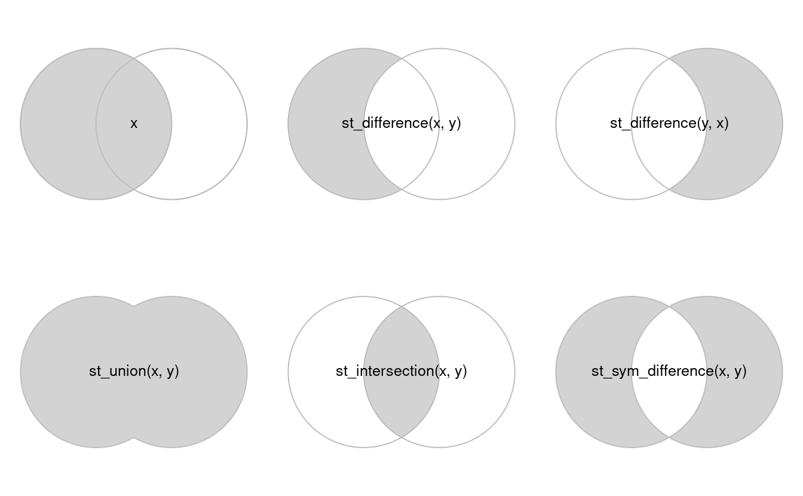

```{r setup}
#| echo: false
#| message: false
library(sf)
library(terra)
library(spData)
```

## Contenidos {.smaller .scrollable}

Operaciones geométricas con datos vectoriales:

1. Simplificación
2. Centroides
3. Buffers
4. Clipping (recortar)
5. Cortar y subconjunto
6. Union

## Simplificación {.smaller .scrollable}

La simplificación es un proceso de generalización de objetos vectoriales (líneas y polígonos) generalmente para su uso en mapas de menor escala.

### `geometria:` linea

```{r}

seine_simp = st_simplify(seine, dTolerance = 2000)  # 2000 m
```
<br>

::: columns

::: {.column width="50%"}
```{r}
#| out.width = "120%"
plot(seine$geometry)
```
:::

::: {.column width="50%"}
```{r}
plot(seine_simp$geometry)
```
:::
:::

## 1. Simplificación  {.smaller .scrollable}

El objeto `seine_simp` resultante es una copia del `seine` original pero con menos vértices. Esto es evidente, siendo el resultado visualmente más simple y consumiendo menos memoria que el objeto original, como se verifica a continuación:

```{r}
object.size(seine)
object.size(seine_simp)
```


## 1. Simplificación  {.smaller .scrollable}

La simplificación es un proceso de generalización de objetos vectoriales (líneas y polígonos) generalmente para su uso en mapas de menor escala.

### `geometria:` polígono

```{r}
us_states2163 = st_transform(us_states, "EPSG:2163")
us_states_simp1 = st_simplify(us_states2163, dTolerance = 100000)  # 100 km
```

::: columns

::: {.column width="50%"}
```{r}
#| out.width = "120%"
plot(us_states2163$geometry)
object.size(us_states2163)
```
:::

::: {.column width="50%"}
```{r}
plot(us_states_simp1$geometry)
object.size(us_states_simp1)
```
:::
:::

## 2. Centroides  {.smaller .scrollable}

Las operaciones de centroide identifican el centro de los objetos geográficos.

La función `st_centroid` de {sf} permite calcular los centroides.

```{r}
nz_centroid = st_centroid(nz)
seine_centroid = st_centroid(seine)
```

## 2. Centroides  {.smaller .scrollable}

Las operaciones de centroide identifican el centro de los objetos geográficos.

```{r}
plot(nz$geom)
plot(nz_centroid$geom,add = TRUE,col='red')
```
## 2. Centroides {.smaller .scrollable}

Las operaciones de centroide identifican el centro de los objetos geográficos.
```{r}
plot(seine$geometry)
plot(seine_centroid$geom,add = TRUE,col = 'red')
```

## 2. Centroides  {.smaller .scrollable}

A veces, el centroide geográfico cae fuera de los límites de sus objetos principales (piense en una dona).

La función `st_point_on_surface` de `{sf}` asegura que los puntos caeran en el objeto.

```{r}
#| out.width = '6cm'
nz_pos = st_point_on_surface(nz)
plot(nz$geom)
plot(nz_pos$geom,add = TRUE,col = 'red')
```

## 2. Centroides  {.smaller .scrollable}

A veces, el centroide geográfico cae fuera de los límites de sus objetos principales (piense en una dona).

La función `st_point_on_surface` de `{sf}` asegura que los puntos caeran en el objeto.

```{r}
seine_pos = st_point_on_surface(seine)
plot(seine$geom)
plot(seine_pos$geom,add = TRUE,col = 'red')
```

## 3. Buffers  {.smaller .scrollable}

Los `buffer` (zonas de influencia) son polígonos que representan el área dentro de una distancia determinada de una entidad geométrica: independientemente de si la entrada es un punto, una línea o un polígono, la salida es un polígono.

```{r}
seine_buff_5km = st_buffer(seine, dist = 5000)
plot(seine_buff_5km$geometry,col ='blue')
plot(seine$geometry,add = TRUE)
```

## 3. Buffers  {.smaller .scrollable}

Los `buffer` (zonas de influencia) son polígonos que representan el área dentro de una distancia determinada de una entidad geométrica: independientemente de si la entrada es un punto, una línea o un polígono, la salida es un polígono.

```{r}
seine_buff_50km = st_buffer(seine, dist = 50000)
plot(seine_buff_50km$geometry,col ='blue')
plot(seine$geometry,add = TRUE)
```

## 4. Recortar (clipping) {.smaller .scrollable}

El recorte espacial es una forma de creación de subconjuntos espaciales que implica cambios en las columnas de geometría de al menos algunas de las entidades afectadas.


{width="800px"}
