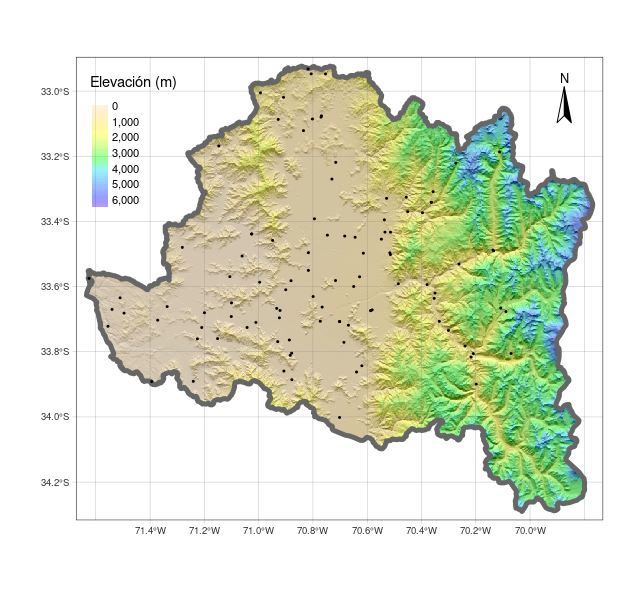

## Descripción

En las primeras clases de la asignatura se ha empezado a trabajar con el software R, partiendo por conocer la sintaxis, la IDE RStudio, las estructuras y tipos de datos. En el primer taller trabajó con datos que vienen incluidos en los paquetes base de R como `mtcars`, aplicando funciones que permitan identificar los tipos de objetos y su estructura, además de realizar proceso de indexación para diferentes tipos de objetos (ej, data.frame, matrix, listas). En el segundo taller, trabajó con datos climáticos en donde tuvo que importar los datos, realizar diferentes tipos de indexaciones, algunas operaciones matemáticas, y exportar los datos a un archivo. En el tercer taller comenzó a familiarizarce con datos vectoriales utilizando `{sf}`. Luego, el el taller número cuatro utilizó las operaciones geométricas con datos vectoriales y `{sf}`. Después, en el taller 5 trabajo con datos raster y vectoriales utilizando `{terra}` y `{sf}` 

## Objetivo del taller

Visualización de mapas estáticos y dinámicos con `{tmap}`

## Paquetes R

Hasta el momento hemos trabajado con los paquetes que vienen inculidos en R base. Ahora empezaremos a trabajar con paquetes adicionales que no vienen instalados por defecto en `R`, por lo que deberá instalarlos. Los paquetes con los que trabajaremos este taller so `{terra}`, `{sf}` y `{tmap}` los que nos permitirán trabajar con datos raster, vectoriales y crear mapas. Además va a utilizar un paquete adicional el cual permite descargar a `R` datos raster de elevación `{elevatr}`.

Para instalar los paquetes debe realizar lo siguiente:

```{r}
#| echo: true

# instala los paquetes
install.packages(c('sf','terra','tmap','elevatr'))

# carga los paqutes en el entorno de R y permite utilizar 
# las funciones adicionales que contienen

library(sf)
library(terra)
library(tmap)
```

## Data

Trabajará con los datos vectoriales utilizados en la evaluación 2 correspondientes a `cuencas` y `estaciones`.


## ¿Qué debe entregar?

Debeŕa utilizar RStudio para crear un script, el cual permitira generar los mapas indicados. Debe utilizar los comentarios (`#`) para hacer una descripción e incorporar cualquier información que ayude a entender lo realizado. A modo de ejemplo:

```{r}
#| eval: false
# Ejercicio 1:
# comentario explicando lo que se hace
{
  Aca va el script que resuelve el ejericio 1
  
}
```

Debe guardar el script con el nombre `taller6_grupo_{número_grupo}.R`. Los archivos los debe subir en el campus virtual en la sección `Actividades -> Talleres -> Taller6`

## Fecha de entrega

Viernes 2 de diciembre hasta las 13:00am

## Creación de modelo digital de elevación para una cuenca de Chile.

1. Cargue los archivos vectoriales correspondientes a:
  - `cuencas_chile`
  - `estaciones_chile`
  
2. Seleccione la cuenca que utilizó en la evaluación 2 y asignela a un nuevo objeto en `R` (ej, cuenca_{nombre_cuenca}).

3. Seleccione las estaciones climáticas que se encuentran en la cuenca utilizada y asígnela a un nuevo objeto en `R` (ej, estaciones_{nombre_cuenca}).

4. Descargue el raster de elevación utilizando el paquete `{elevatr}` y la función `get_elev_raster`

```{r}
dem <- get_elev_raster(cuenca_{nombre_cuenca})
```

5. Haga una mascara del dem para la cuenca asignada, elimine los espacios en blanco.

6. Cree un hillshade (mapa de sombras) del dem. Para esto debe crear un raster de aspecto (dirección) y slope (pendiente) a partir de el `dem`. Debe utilizar las funciones de `{terra}` `terrain` y `shade`.

```{r}
slope = terrain(dem, v='slope',unit = 'radians')
aspect = terrain(dem, v='aspect',unit = 'radians')
hill = shade(slope, aspect)
```

7. Utilice `{tmap}` para crear la visualización del hillshade. Asigne el mapa creado al obejto `mapa`.

```{r}

library(tmap)

tmap_mode('plot')
mapa <- tm_shape(hill) +
  tm_raster(style = 'cont',palette = grey(0:100/100),legend.show = FALSE) +
  tm_shape(dem) +
  tm_raster(title= 'Elevación (m)', style ='cont',palette = rev(topo.colors(20)),alpha = .4) +
  tm_graticules(lwd = .4,alpha = .6) +
  tm_compass(position = c('right','top'))
```

## Agregar límites de la cuenca y estaciones

1. Cree un mapa de los bordes de la cuenca.
2. Agrege al mapa las estaciones que corresponden a la cuenca.
3. Una el mapa del punto anterior con el de los límites de la cuenca y las estaciones.
4. Transforme el mapa anterior en un mapa interactivo

##  Export mapas creados

1. Exporte el mapa estático creado como `mapa_estatico_{nombre_cuenca}.png`
2. Exporte el mapa interactivo creado como `mapa_interactivo_{nombre_cuenca}.png`

## Ejemplo de resultado

{width='100%'}

{width="100%" height=500}